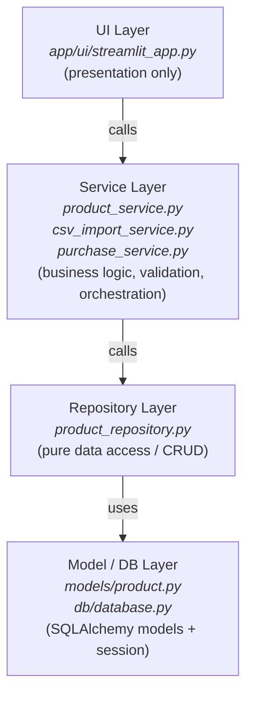
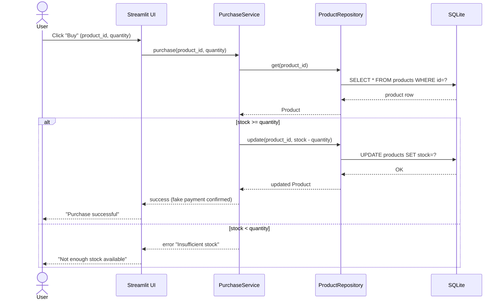
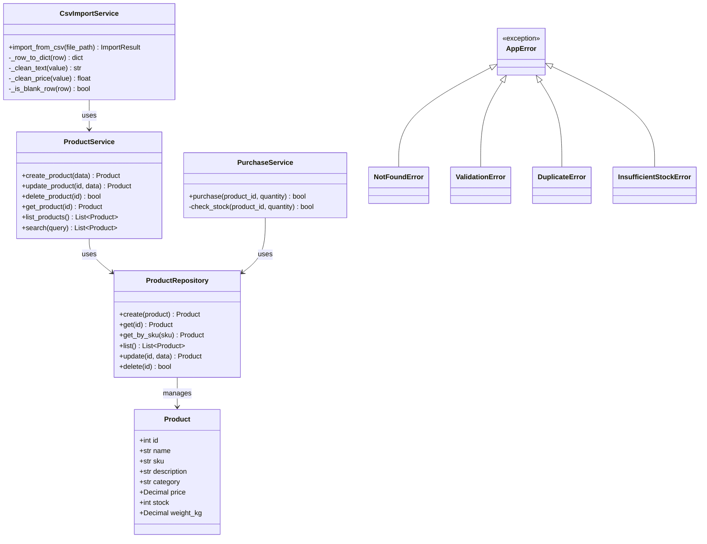

# Architecture

## Overview

This application follows a **layered architecture** to separate concerns and keep the codebase maintainable, testable, and easy to evolve. This means the UI (Streamlit) could be swapped for a REST API (FastAPI) or a different frontend without touching how products are validated, stored, or purchased.

## High-Level Architecture (Container View)

## Layers

## Sequence Diagram — Purchase Flow

Shows the calls across layers for the main use case: purchasing a product.

## Class Diagram (Product domain)

### UI Layer (`app/ui/`)
Responsible **only** for rendering and capturing user input. It calls the service layer and displays results — it never talks to the database or repository directly, and it contains no business rules (e.g., it doesn't decide whether a SKU is valid; it just shows the error the service layer returns).

### Service Layer (`app/services/`)
Contains the business rules: validating input, orchestrating multiple repository calls, applying domain logic (e.g., "purchasing a product must decrement stock and fail if stock is insufficient"). This is the layer unit tests target most heavily, since it holds the logic that actually matters to correctness. It is implemented in a modular way, so that each responsibility is handled by one, and only one, module — reducing maintenance effort and bug-fixing time.

### Repository Layer (`app/repository/`)
Pure data access — create, read, update, delete against the database, with no business logic mixed in. This makes it easy to swap SQLite for another database later if needed, or to mock it entirely in tests.

### Model / DB Layer (`app/models/`, `app/db/`)
SQLAlchemy models (the schema definition) and the database session/engine setup.

### Exceptions (`app/exceptions.py`)
A shared exception hierarchy (`AppError` as base, with `NotFoundError`, `ValidationError`, `DuplicateError`, `InsufficientStockError` as specific subtypes) used across all services. This lets the UI catch errors either generically (`except AppError`) or specifically (`except DuplicateError`) without relying on parsing error message text.

## Key Design Decisions

### 1. SQLite + SQLAlchemy (instead of PostgreSQL)
Given the 5-business-day timebox, SQLite was chosen for zero-configuration local persistence (a single file, no separate DB server/container to manage). SQLAlchemy is used as the ORM layer specifically so that **switching to PostgreSQL later would only require changing the connection string** — the models, repository, and service layers would not need to change. This keeps the "enterprise-readiness" trade-off explicit: it's a deliberate simplification for the timebox, not a lack of awareness of production requirements.

### 2. Streamlit (instead of a fully separated frontend/backend)
A frontend/backend split (e.g., FastAPI + React) is the more decoupled, "correct" architecture for a real production system. It was considered, but given the time constraint, Streamlit was chosen for the presentation layer to maximize time spent on correct business logic and data modeling rather than frontend plumbing. To avoid mixing the UI with business logic in Streamlit scripts, **the UI layer is kept as a thin client that only calls the service layer** — no business rules live in `streamlit_app.py`. This means migrating to a REST API frontend later would only require replacing the UI layer.

### 3. `price` as `Numeric`, not `Float`
Floating point numbers introduce rounding errors that are unacceptable for currency values. `Numeric` stores exact decimal values.

### 4. `sku` as a unique constraint
Assumed to be the real-world identifier for a product in a catalog, so it's enforced as unique at the database level. A surrogate `id` (auto-incrementing integer primary key) is kept separate from `sku` (a natural key) — this protects internal relationships (e.g., a future `Order` referencing a product) from breaking if a SKU format ever changes, which is common in real catalog systems.

### 5. Purchase flow as a simple conditional check (not a state machine)
A state machine was considered for the purchase flow, since the domain has a natural parallel to state-driven design (familiar from automotive/embedded systems). However, the current purchase flow is a single-transaction, binary outcome (sufficient stock vs. insufficient stock) — not an entity that persists across multiple states over time. A state machine would be a better fit for an `Order` entity with a real lifecycle (e.g., `Created → PaymentPending → PaymentConfirmed → Failed`), but since the challenge explicitly fakes the payment step, that complexity was considered out of scope for this timebox.

### 6. Single entry point today — extensibility to multiple clients
The current architecture has a single entry point (the Streamlit UI). The layered design partially supports evolving toward multiple clients (e.g., serving external customers or systems): because the Service Layer has no dependency on Streamlit, it could in principle be called from another entry point.

However, "another entry point" today only works if that code runs **within the same Python process** (e.g., a script importing the services directly). Serving genuinely external clients (another company, another app, a mobile client) requires network-level communication, which the current design does not expose. The layering does not eliminate that effort — it reduces it, by keeping the Service Layer free of presentation logic so that adding an API layer (e.g., FastAPI) on top would **expose** the existing services rather than **rewrite** them.

This aligns with an agile mindset: this architecture is "good enough" for the current scope, and the layering is what makes future iterations tractable rather than a rewrite. Adapting a system for new requirements is never a strictly incremental, one-to-one change — even well-established industry standards evolve non-trivially over time — but a clean layered foundation keeps that adaptation cost proportional to the actual change in requirements.

**A concrete risk worth flagging for multi-client scenarios: concurrency.** If multiple clients attempt to purchase the same product simultaneously, stock validation and the stock update must be atomic (a transaction that locks the row during check-and-update), or the system is exposed to race conditions — two purchases could both pass the "stock available" check before either decrements it, overselling the product. SQLite handles concurrent writes from multiple processes poorly, which reinforces Design Decision #1: PostgreSQL would become a hard requirement (not just a nice-to-have) once true multi-client concurrency is in scope, since it supports row-level locking for atomic transactions.

### 7. `CsvImportService` depends on `ProductService`, not `ProductRepository` directly
The initial design had `CsvImportService` calling `ProductRepository` directly. While implementing, this initial design decision changed: the CSV import needs the exact same business validation as any other product creation path. Calling the Repository directly would have required duplicating that validation logic, risking the CSV import path allowing invalid data that no other entry point would permit. This means every product passes through the same validation rules exactly once.

### 8. Price of exactly `$0.00` is treated as valid
An early validation bug rejected products with `price = 0.00` as "missing required field," because Python treats `0.0` as a falsy value. This was corrected: a `None` or empty price is invalid, but an explicit `0.00` is treated as a legitimate value (e.g., promotional or free items, such as a "Mystery Box" product found in the test dataset). See `Bugs.md` for the full root-cause writeup.

## What Would Change for a Production Deployment

Given the time constraint, the priority was to have a working "first version." If a more production-ready, robust version is needed later, the following changes would apply:

- **Database:** SQLite → PostgreSQL (connection string change only, thanks to SQLAlchemy)
- **UI:** Streamlit → REST API (FastAPI) + separately deployed frontend, for independent scaling and better separation of deploy cycles
- **Auth:** none implemented (out of scope) — would add an auth/authorization layer between UI and service layer
- **Payment:** Faked — would integrate a real payment provider behind the `purchase_service` interface, without changing its calling contract
- **Order lifecycle:** if order tracking becomes a requirement, model it as a state machine (see Design Decision #5)
- **Multiple clients:** add an API layer (e.g., FastAPI) exposing the existing Service Layer over the network, without rewriting business logic (see Design Decision #6); combined with the PostgreSQL migration, this would also require row-level locking on stock updates to prevent overselling under concurrent purchases

## Note on Code Comments
Per the challenge instructions ("if you use AI, please remove comments from the code"), the source code intentionally contains no inline comments. Any "why" behind a non-obvious implementation choice is documented here instead, or in `Bugs.md`, rather than as code comments.
