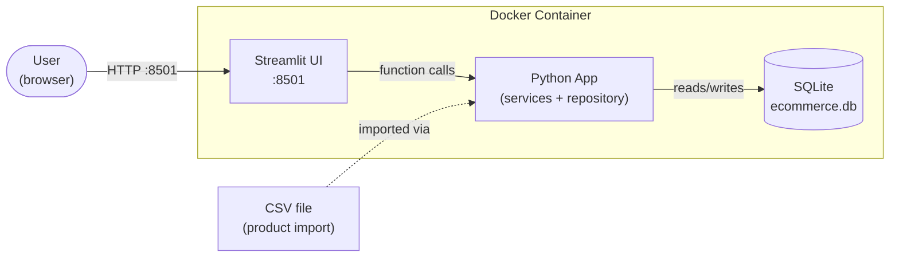
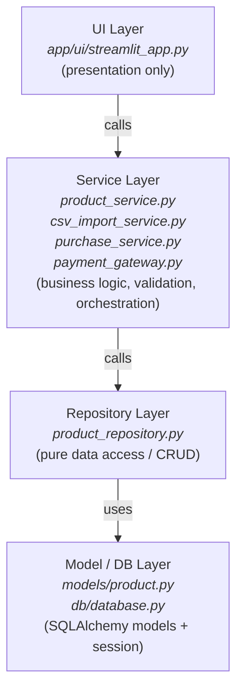
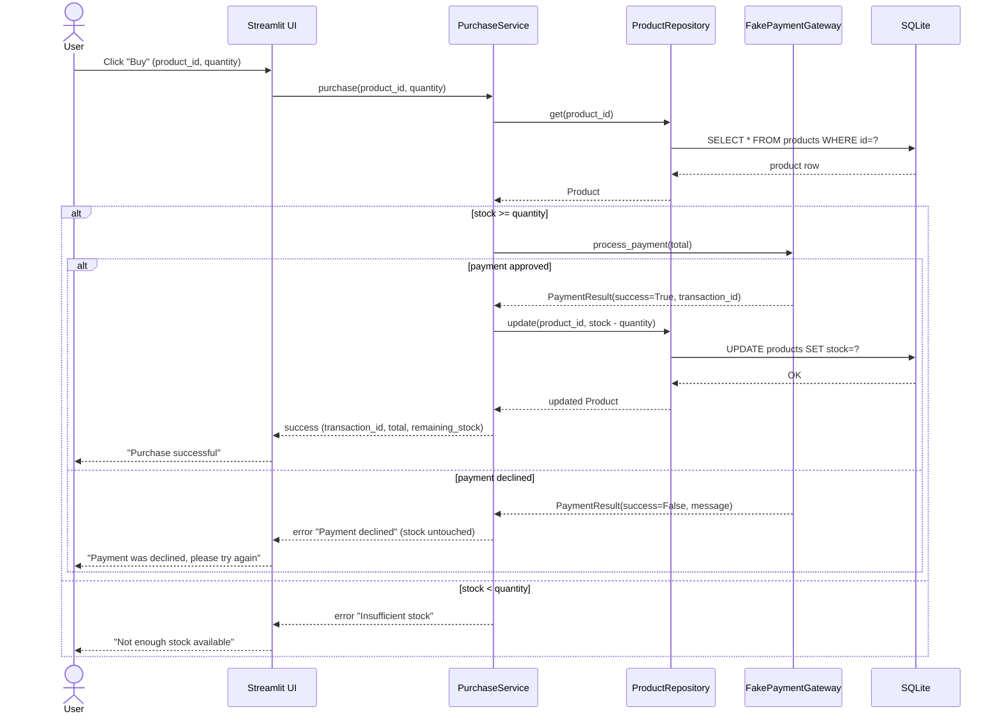
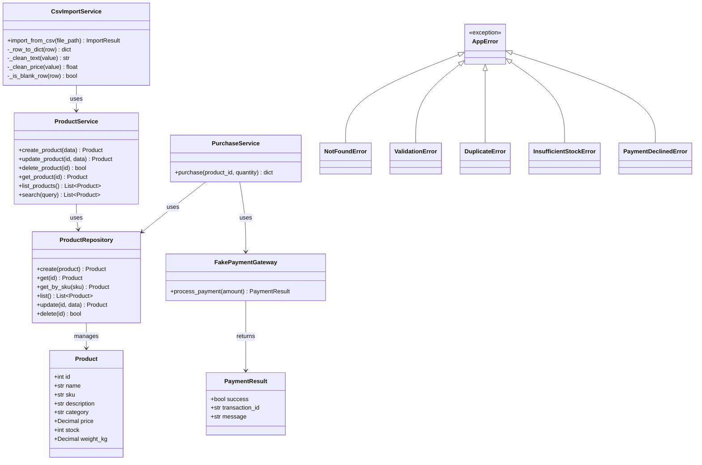

# Architecture

## Overview

This application follows a **layered architecture** to separate concerns and keep the codebase maintainable, testable, and easy to evolve. This means the UI (Streamlit) could be swapped for a REST API (FastAPI) or a different frontend without touching how products are validated, stored, or purchased.

## High-Level Architecture (Container View)

## Layers

## Sequence Diagram — Purchase Flow

Shows the calls across layers for the main use case: purchasing a product.

## Class Diagram (Product domain)

### UI Layer (`app/ui/`)
Responsible **only** for rendering and capturing user input. It calls the service layer and displays results — it never talks to the database or repository directly, and it contains no business rules (e.g., it doesn't decide whether a SKU is valid; it just shows the error the service layer returns).

**Note on style:** unlike the rest of the codebase (which is class-based OOP), the UI layer is written as procedural scripts. This matches Streamlit's own execution model — the entire script reruns top-to-bottom on every user interaction, so wrapping pages in classes would not provide the usual OOP benefits (state has to live in `st.session_state` regardless of whether the surrounding code is a class or a script). Business logic that does benefit from encapsulation and reuse (validation, orchestration, persistence) stays in the class-based Service/Repository layers underneath; the UI stays a thin, procedural caller of those objects.

### Service Layer (`app/services/`)
Contains the business rules: validating input, orchestrating multiple repository calls, applying domain logic (e.g., "purchasing a product must decrement stock and fail if stock is insufficient"). This is the layer unit tests target most heavily, since it holds the logic that actually matters to correctness. It is implemented in a modular way, so that each responsibility is handled by one, and only one, module — reducing maintenance effort and bug-fixing time.

### Repository Layer (`app/repository/`)
Pure data access — create, read, update, delete against the database, with no business logic mixed in. This makes it easy to swap SQLite for another database later if needed, or to mock it entirely in tests.

### Model / DB Layer (`app/models/`, `app/db/`)
SQLAlchemy models (the schema definition) and the database session/engine setup.

### Core / Cross-Cutting Infrastructure (`app/core/`)
Holds code that doesn't belong to any single layer of the data flow (UI → Service → Repository → Model/DB), but is used across several of them:
- **`exceptions.py`** — a shared exception hierarchy (`AppError` as base, with `NotFoundError`, `ValidationError`, `DuplicateError`, `InsufficientStockError`, `PaymentDeclinedError` as specific subtypes) used across all services. This lets the UI catch errors either generically (`except AppError`) or specifically (`except DuplicateError`) without relying on parsing error message text.
- **`logging_config.py`** — centralized logging setup (see Design Decision #17).

## Key Design Decisions

### 1. SQLite + SQLAlchemy (instead of PostgreSQL)
Given the time constraint, SQLite was chosen for zero-configuration local persistence (a single file, no separate DB server/container to manage). SQLAlchemy is used as the ORM layer specifically so that **switching to PostgreSQL later would only require changing the connection string** — the models, repository, and service layers would not need to change. This keeps the "enterprise-readiness" trade-off explicit: it's a deliberate simplification for the timebox, not a lack of awareness of production requirements.

### 2. Streamlit (instead of a fully separated frontend/backend)
A frontend/backend split (e.g., FastAPI + React) is the more decoupled, "correct" architecture for a real production system. It was considered, but given the time constraint, Streamlit was chosen for the presentation layer to maximize time spent on correct business logic and data modeling rather than frontend plumbing. To avoid mixing the UI with business logic in Streamlit scripts, **the UI layer is kept as a thin client that only calls the service layer** — no business rules live in `streamlit_app.py`. This means migrating to a REST API frontend later would only require replacing the UI layer.

### 3. `price` as `Numeric`, not `Float`
Floating point numbers introduce rounding errors that are unacceptable for currency values. `Numeric` stores exact decimal values.

### 4. `sku` as a unique constraint
Assumed to be the real-world identifier for a product in a catalog, so it's enforced as unique at the database level. A surrogate `id` (auto-incrementing integer primary key) is kept separate from `sku` (a natural key) — this protects internal relationships (e.g., a future `Order` referencing a product) from breaking if a SKU format ever changes, which is common in real catalog systems.

### 5. Purchase flow as a simple conditional check (not a state machine)
A state machine was considered for the purchase flow, since the domain has a natural parallel to state-driven design (familiar from automotive/embedded systems). However, the current purchase flow is a single-transaction, binary outcome (sufficient stock vs. insufficient stock) — not an entity that persists across multiple states over time. A state machine would be a better fit for an `Order` entity with a real lifecycle (e.g., `Created → PaymentPending → PaymentConfirmed → Failed`), but since the challenge explicitly fakes the payment step, that complexity was considered out of scope for this timebox.

### 6. Single entry point today — extensibility to multiple clients
The current architecture has a single entry point (the Streamlit UI). The layered design partially supports evolving toward multiple clients (e.g., serving external customers or systems): because the Service Layer has no dependency on Streamlit, it could in principle be called from another entry point.

However, "another entry point" today only works if that code runs **within the same Python process** (e.g., a script importing the services directly). Serving genuinely external clients (another company, another app, a mobile client) requires network-level communication, which the current design does not expose. The layering does not eliminate that effort — it reduces it, by keeping the Service Layer free of presentation logic so that adding an API layer (e.g., FastAPI) on top would **expose** the existing services rather than **rewrite** them.

This aligns with an agile mindset: this architecture is "good enough" for the current scope, and the layering is what makes future iterations tractable rather than a rewrite. Adapting a system for new requirements is never a strictly incremental, one-to-one change — even well-established industry standards evolve non-trivially over time — but a clean layered foundation keeps that adaptation cost proportional to the actual change in requirements.

**A concrete risk worth flagging for multi-client scenarios: concurrency.** If multiple clients attempt to purchase the same product simultaneously, stock validation and the stock update must be atomic (a transaction that locks the row during check-and-update), or the system is exposed to race conditions — two purchases could both pass the "stock available" check before either decrements it, overselling the product. SQLite handles concurrent writes from multiple processes poorly, which reinforces Design Decision #1: PostgreSQL would become a hard requirement (not just a nice-to-have) once true multi-client concurrency is in scope, since it supports row-level locking for atomic transactions.

### 7. `CsvImportService` depends on `ProductService`, not `ProductRepository` directly
The initial design had `CsvImportService` calling `ProductRepository` directly. While implementing, this initial design decision changed: the CSV import needs the exact same business validation as any other product creation path. Calling the Repository directly would have required duplicating that validation logic, risking the CSV import path allowing invalid data that no other entry point would permit. This means every product passes through the same validation rules exactly once.

### 8. Price of exactly `$0.00` is treated as valid
An early validation bug rejected products with `price = 0.00` as "missing required field," because Python treats `0.0` as a falsy value. This was corrected: a `None` or empty price is invalid, but an explicit `0.00` is treated as a legitimate value (e.g., promotional or free items, such as a "Mystery Box" product found in the test dataset). See `Bugs.md` for the full root-cause writeup.

### 9. Fake payment as a mockable gateway, not a skipped step
Rather than skipping payment entirely, purchases go through a `FakePaymentGateway` — a class with the same shape a real payment provider integration would have (`process_payment(amount) -> PaymentResult`). It simulates a 10% decline rate. `PurchaseService` accepts the gateway via dependency injection (defaulting to `FakePaymentGateway` if none is provided). Naming it `FakePaymentGateway` is intentional to document its own nature directly in the code.

**Order of operations:** stock is checked, then payment is attempted, and only on approval stock is decremented.

### 10. Admin/Storefront navigation split, without real authentication
The challenge implies two distinct real-world personas — the seller managing the catalog, and the end customer searching and purchasing — even though the spec does not explicitly require role separation or auth. The UI reflects this distinction at the navigation level: `st.navigation()` groups pages into "Admin" (product management) and "Shop" (search, purchase) sections in the sidebar, without any login — anyone can access any page today. At the same time `app/ui/services.py` exposes separate getters (`get_product_service()`, `get_csv_import_service()`, `get_purchase_service()`) rather than a single function returning everything. This was a deliberate, scoped trade-off: the getters currently all return the same full `ProductService` (which has both read methods like `search`/`get_product` and write methods like `create_product`/`delete_product`), so a Storefront page technically *could* call an Admin-only method — nothing prevents it at the type level today. A stronger version of this separation was considered — splitting `ProductService` into a read-only `ProductCatalogService` (for Storefront) and a `ProductAdminService` (for Admin), so that Storefront pages would receive an object that does not even define write methods, making misuse a hard `AttributeError` rather than a convention to follow. This was deferred given the timebox; the current getters are the point where that split would happen without touching page code, if pursued later.

### 11. Search and Purchase merged into a single "Shop" page, one product at a time
The Storefront was initially planned as two separate pages (Search, then a distinct Purchase page). The two were merged into a single `storefront_shop.py` page: search results are shown as a list, each with its own quantity selector and "Buy" button inline, so search and purchase happen in the same view. `PurchaseService.purchase(product_id, quantity)` still handles one product at a time — a real shopping cart was considered and explicitly deferred. Implementing a cart would require: cart state in `st.session_state`, a new `PurchaseService` method to handle multiple items in one payment attempt, and a business decision on how to handle partial stock failures. This is a next step to improve the system.

### 12. Confirmation messages: `st.toast` in Admin, contextual inline messages in Shop
Purchase/update/delete confirmations were originally implemented globally with `st.toast()`, intended to auto-dismiss after a few seconds. However the message did not update to reflect the latest action, a behavior consistent with a known Streamlit issue when `st.toast()` is combined with `st.rerun()` (see `Bugs.md`).

Two different resolutions were applied depending on the page:
- **Admin (`admin_products.py`):** kept `st.toast()` via the shared `show_flash()` component; its exposure to this bug was later narrowed further — see Design Decision #14, which moved Create and Update confirmations to a separate, per-tab "pop" pattern. `st.toast()` on the Admin side now only fires for product deletion and CSV import (see Design Decision #16) — two actions that don't naturally occur back to back within the toast's ~4-second window in normal use.
- **Shop page** (`storefront_shop.py`): does not use the global flash pattern at all. Since buying multiple different products in quick succession is a realistic customer behavior, a global toast is fragile here. Instead, each product's purchase result is rendered as a persistent message inline within that product's own container, with a manual dismiss button. Only the most recent purchase's message is kept.

### 13. Purchase confirmation via `st.dialog`, not an inline confirm/cancel step
To prevent accidental purchases, a confirmation step was added before `PurchaseService.purchase()` is actually called. Here, `st.dialog()` is used for this purpose as a native modal. Only one dialog can be open at a time, which also prevents two confirmations from being open simultaneously.

### 14. Admin confirmation messages: consumed-once ("pop") pattern instead of persistent
Create and Update confirmation messages on the Admin product page are deleted from `st.session_state` immediately after being rendered once, rather than kept persistently. This means the message still displays and stays visible on screen until the user's next interaction of any kind. Delete still uses the shared global `st.toast()` flash (see Design Decision #12) since a deleted product leaves no stable container to attach an inline message to.

### 15. Button color semantics: `primary` for the expected action, `secondary` for exit/destructive actions
Streamlit's `st.button` only offers three styles (`primary`: filled with the app's single theme accent color; `secondary`: outlined, blends with the background; `tertiary`: plain text) — there is no built-in distinct "danger" color separate from `primary`, and custom per-button colors would require injecting custom CSS, which was avoided elsewhere in this project for fragility and consistency reasons.

Given that constraint, a consistent semantic was applied across the app rather than assigning color arbitrarily per button: `type="primary"` marks the expected, main action of a section (Create Product, Update Product, Buy, Confirm purchase, Import CSV), while `type="secondary"` (the default when no type is set) is used for exit or destructive actions (Delete Product, Cancel). This is a deliberate UX choice, intended to reduce the chance of an accidental click on what is, as noted above, a destructive action.

**Future improvement:** a distinct, purpose-built color palette was not pursued within the timebox, since it would require either custom CSS or a Streamlit theme config that only supports a single accent color. Worth revisiting with a proper design system if the UI evolves beyond this challenge's scope.

### 16. CSV Import merged into the "Manage Products" page as a fourth tab
`admin_import_csv.py` originally existed as its own page in the Admin section. It was folded into `admin_products.py` as a fourth tab ("Import CSV"). Grouping every product-management action under one page reduces navigation and keeps related functionality together.

### 17. Logging: standard library `logging`, append-only file, session marker per process
Logging uses Python's built-in `logging` module. Configuration lives in `app/core/logging_config.py` (see "Core / Cross-Cutting Infrastructure" above) and is applied once via `configure_logging()`, called at the top of `streamlit_app.py`.

- **Output:** both a `FileHandler` (`logs/app.log`, append mode) and a `StreamHandler` (console/`docker logs`) are attached, so logs are visible during local development and when running in a container without needing to exec into it.
- **Retention:** the log file is never truncated or rotated — it grows indefinitely for the lifetime of the deployment. This is an explicit, documented simplification for this timebox; see the production notes below.
- **Level and placement:** logging calls live in the Service Layer, so only meaningful business events get logged. `INFO` marks successful business events (product created/updated/deleted, purchase completed, CSV import summary). `WARNING` marks expected-but-notable business outcomes that aren't system errors (duplicate SKU rejected, insufficient stock, payment declined).
- **Session marker:** a single `=== New application session started ===` line is logged once per **process**, not per browser tab or user session.
- **Unexpected errors:** each UI page wraps its service calls with a final `except Exception` that uses `logger.exception(...)`, which automatically captures the full traceback, making an unexpected bug debuggable after the fact.

**Future improvement (production):** a single ever-growing local file does not scale past a single-instance demo/local deployment. Production would need log rotation (`RotatingFileHandler`/`TimedRotatingFileHandler`) to bound disk usage, structured (JSON) log output for machine parsing, and shipping logs to a centralized aggregator (e.g., CloudWatch, ELK, Datadog). Even though INFO-level events are already limited to meaningful business actions, production traffic volume would still make them noisy; raising the level to WARNING would keep only failure/notable signals, appropriate once the goal shifts from full audit trail to error monitoring.

## What Would Change for a Production Deployment

Given the time constraint, the priority was to have a working "first version." If a more production-ready, robust version is needed later, the following changes would apply:

- **Database:** SQLite → PostgreSQL (connection string change only, thanks to SQLAlchemy)
- **UI:** Streamlit → REST API (FastAPI) + separately deployed frontend, for independent scaling and better separation of deploy cycles
- **Auth:** none implemented (out of scope) — would add an auth/authorization layer between UI and service layer; combined with Design Decision #10, this would also justify splitting `ProductService` into `ProductAdminService`/`ProductCatalogService` so Storefront pages structurally cannot access write operations, rather than relying on convention
- **Payment:** `FakePaymentGateway` → a real provider, implementing the same `process_payment(amount) -> PaymentResult` shape so `PurchaseService` would not need to change
- **Order lifecycle:** if order tracking becomes a requirement, model it as a state machine (see Design Decision #5)
- **Multiple clients:** add an API layer (e.g., FastAPI) exposing the existing Service Layer over the network, without rewriting business logic (see Design Decision #6); combined with the PostgreSQL migration, this would also require row-level locking on stock updates to prevent overselling under concurrent purchases
- **Shopping cart:** replace the current one-product-at-a-time purchase flow with a real cart to handle multiple items in a single payment attempt, and a defined policy for partial stock failures at checkout (see Design Decision #11)
- **Confirmation UX:** a reliably auto-dismissing notification would replace the current split approach — `st.toast` in Admin (accepted low-risk) and persistent inline messages in Shop (see Design Decision #12)
- **Visual design system:** a proper color palette would replace the current `primary`/`secondary` button semantics (see Design Decision #15)
- **Logging:** log rotation, structured (JSON) output, and centralized log aggregation would replace the current single append-only local file (see Design Decision #17). Raise log level from INFO to WARNING.

## Note on Code Comments
Per the challenge instructions ("if you use AI, please remove comments from the code"), the source code intentionally contains no inline comments. Any "why" behind a non-obvious implementation choice is documented here instead, or in `Bugs.md`, rather than as code comments.
